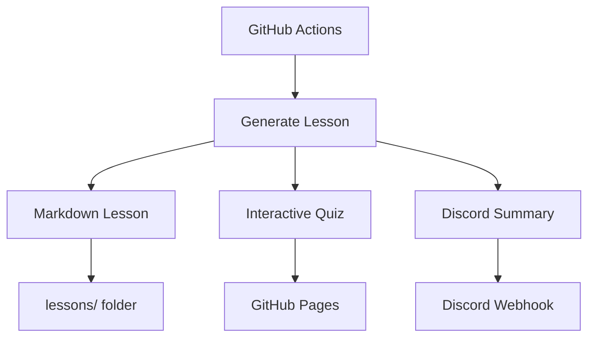

# System Design Daily

> Automated daily system design lessons with interactive quizzes, powered by GitHub Actions

[](https://github.com/AlexCSalinas/system-design-daily/actions/workflows/daily-deepdive.yml)
[](https://alexcsalinas.github.io/system-design-daily/)
[](https://discord.gg/kavAJuK24F)

## What is this?

A fully automated learning platform that generates daily system design lessons and quizzes. Set up once, runs forever. No manual work required.

**[Take Today's Quiz](https://alexcsalinas.github.io/system-design-daily/)**

**[Discord Community](https://discord.gg/kavAJuK24F)**

## Features

**Fully Automated**
- Daily lessons via GitHub Actions (8 AM EST)
- Zero maintenance required
- 30+ day curriculum covering fundamentals to advanced topics

**Comprehensive Content**
- Real-world examples from Netflix, Uber, WhatsApp, Twitter
- Interactive quizzes with immediate feedback
- Mermaid diagrams for visual learning
- Discussion questions for deeper understanding

**Multi-Channel Delivery**
- Discord notifications with daily summaries
- GitHub Pages for quiz taking
- Markdown lessons with detailed explanations
- Mobile-friendly design

## Sample Topics

- Load Balancers, Caching, Database Design
- Distributed Systems, Consensus Algorithms, CAP Theorem  
- Microservices, Event-Driven Architecture, Message Queues
- Performance Optimization, Monitoring, Security
- Advanced patterns, ML Infrastructure, Real-world Case Studies

## How It Works



Daily automation:
1. 8 AM EST: GitHub Actions triggers workflow
2. Generates detailed lesson with examples and diagrams
3. Creates interactive quiz with multiple choice questions
4. Sends concept summary to Discord
5. Quiz appears on GitHub Pages automatically

## Getting Started

**For Learners:**
- [Take today's quiz](https://alexcsalinas.github.io/system-design-daily/)
- [Join Discord](https://discord.gg/kavAJuK24F) for daily notifications
- Browse lessons in the [`lessons/`](./lessons/) folder

**For Developers:**
- Fork this repository
- Set up Discord webhook in repository secrets (`DISCORD_WEBHOOK_URL`)
- Enable GitHub Pages (Settings → Pages → Source: `main` branch `/docs` folder)
- Customize curriculum in [`content/curriculum.json`](./content/curriculum.json)
- Workflow runs automatically daily

## Project Structure

```
system-design-daily/
├── .github/workflows/
│   └── daily-deepdive.yml          # Main automation workflow
├── content/
│   └── curriculum.json             # 60+ day curriculum database
├── scripts/
│   ├── generate-lesson.js          # Creates lessons and quizzes
│   ├── commit-lesson.js            # Commits directly to main
│   └── send-discord.js             # Discord integration
├── lessons/                        # Generated markdown lessons
├── docs/                          # GitHub Pages content
│   ├── index.html                 # Homepage with dynamic links
│   └── quiz-*.html                # Daily interactive quizzes
└── package.json                   # Dependencies
```

## Tech Stack

- GitHub Actions - Daily automation
- Node.js - Lesson generation scripts
- Mermaid - System architecture diagrams
- GitHub Pages - Static site hosting
- Discord Webhooks - Daily notifications
- Vanilla JavaScript - Quiz functionality

## Contributing

Want to improve the curriculum or add features?

1. Fork the repository
2. Add new lessons to `content/curriculum.json`
3. Improve quiz questions or add new features
4. Submit a Pull Request

Ideas:
- More real-world case studies
- Better quiz interactions
- Progress tracking
- Multi-language support

## License

MIT - Fork and adapt as needed.

---

[Start Learning](https://alexcsalinas.github.io/system-design-daily/) • [Join Discord](https://discord.gg/kavAJuK24F)
