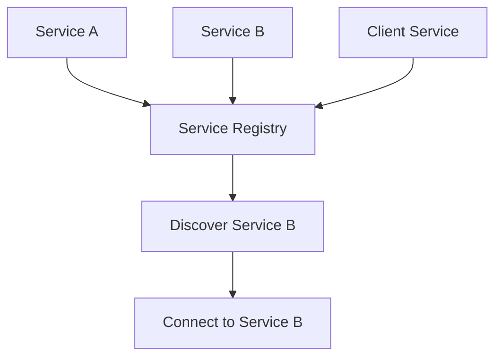

# Day 16: Dynamic Service Location in Microservices

## Overview
Service discovery enables services to find and communicate with each other dynamically in distributed systems without hardcoded addresses.

## Key Concepts
- **Service Registry**
- **Health Checks**
- **DNS-based Discovery**
- **Load Balancing Integration**

## System Diagram

## Real-World Example
Netflix uses Eureka for service discovery, allowing their microservices to dynamically find dependencies across multiple AWS regions

## Discussion Questions
1. How do you handle service discovery during network partitions?
2. What are the trade-offs between client-side and server-side service discovery?

## Additional Resources
- [System Design Interview Guide](https://github.com/donnemartin/system-design-primer)
- [High Scalability](http://highscalability.com/)

---
*Generated on 2025-08-24 | [Take Today's Quiz](../docs/quiz-2025-08-24.html)*
