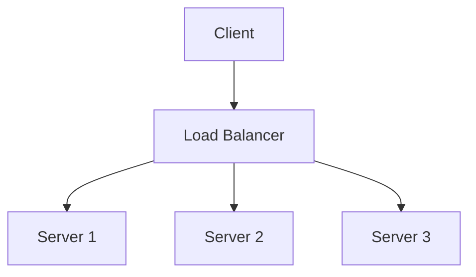

# Day 1: Understanding Load Balancing Strategies

## Overview
Load balancers distribute incoming requests across multiple servers to prevent overload and ensure high availability.

## Key Concepts
- **Round Robin**
- **Least Connections**
- **Layer 4 vs Layer 7**

## System Diagram

## Real-World Example
Netflix uses ELB to handle millions of streaming requests

## Discussion Questions
1. When would you choose Layer 4 over Layer 7 load balancing?
2. How would you handle sticky sessions with load balancing?

## Additional Resources
- [System Design Interview Guide](https://github.com/donnemartin/system-design-primer)
- [High Scalability](http://highscalability.com/)

---
*Generated on 2025-08-29 | [Take Today's Quiz](../docs/quiz-2025-08-29.html)*
