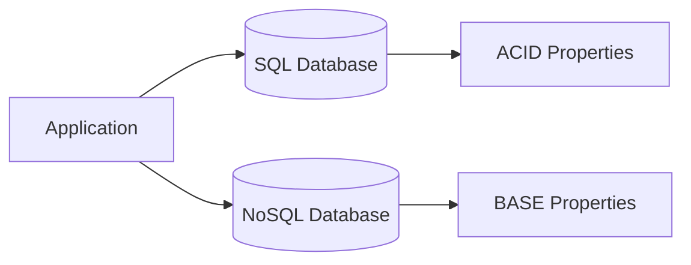

# Day 2: SQL vs NoSQL Database Selection

## Overview
Understanding when to use relational databases versus NoSQL databases based on data structure, consistency, and scalability requirements.

## Key Concepts
- **ACID Properties**
- **BASE Properties**
- **Horizontal vs Vertical Scaling**
- **Data Consistency**

## System Diagram

## Real-World Example
Facebook uses MySQL for user data and Cassandra for messaging due to different consistency requirements

## Discussion Questions
1. What factors would lead you to choose MongoDB over PostgreSQL?
2. How do you handle transactions in a NoSQL environment?

## Additional Resources
- [System Design Interview Guide](https://github.com/donnemartin/system-design-primer)
- [High Scalability](http://highscalability.com/)

---
*Generated on 2025-08-30 | [Take Today's Quiz](../docs/quiz-2025-08-30.html)*
