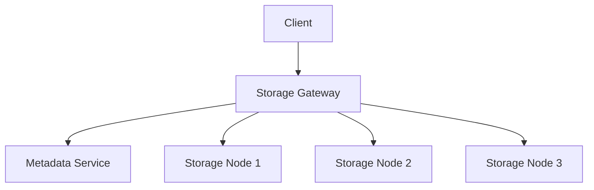

# Day 14: Distributed File Storage and Object Storage

## Overview
Distributed file storage systems provide scalable, durable storage for large amounts of unstructured data across multiple servers.

## Key Concepts
- **Object Storage**
- **Replication**
- **Erasure Coding**
- **Metadata Management**

## System Diagram

## Real-World Example
Amazon S3 stores trillions of objects and handles millions of requests per second using distributed object storage architecture

## Discussion Questions
1. How do you ensure data durability in a distributed storage system?
2. What are the trade-offs between object storage and traditional file systems?

## Additional Resources
- [System Design Interview Guide](https://github.com/donnemartin/system-design-primer)
- [High Scalability](http://highscalability.com/)

---
*Generated on 2025-09-11 | [Take Today's Quiz](../docs/quiz-2025-09-11.html)*
