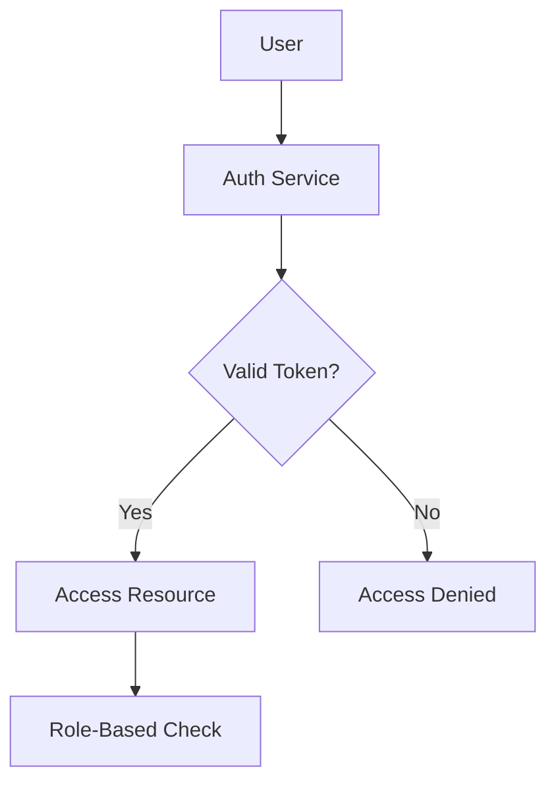

# Day 15: Securing Access to Distributed Systems

## Overview
Authentication verifies user identity while authorization determines what resources they can access in distributed systems.

## Key Concepts
- **JWT Tokens**
- **OAuth 2.0**
- **RBAC**
- **SSO**

## System Diagram

## Real-World Example
Google's OAuth 2.0 implementation allows users to sign into thousands of third-party applications without sharing passwords

## Discussion Questions
1. How would you implement JWT token refresh in a microservices architecture?
2. What are the security considerations when implementing SSO?

## Additional Resources
- [System Design Interview Guide](https://github.com/donnemartin/system-design-primer)
- [High Scalability](http://highscalability.com/)

---
*Generated on 2025-09-12 | [Take Today's Quiz](../docs/quiz-2025-09-12.html)*
