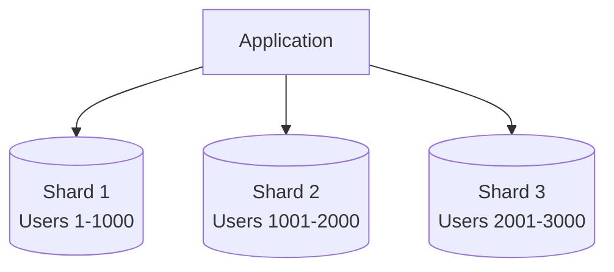

# Day 8: Horizontal Database Partitioning

## Overview
Sharding distributes data across multiple database instances to handle large datasets and high throughput requirements.

## Key Concepts
- **Shard Key**
- **Hash-based Sharding**
- **Range-based Sharding**
- **Cross-shard Queries**

## System Diagram

## Real-World Example
Instagram shards user data by user ID, allowing them to store billions of photos across thousands of database servers

## Discussion Questions
1. How would you handle resharding when adding new database servers?
2. What are the challenges of implementing joins across shards?

## Additional Resources
- [System Design Interview Guide](https://github.com/donnemartin/system-design-primer)
- [High Scalability](http://highscalability.com/)

---
*Generated on 2025-09-25 | [Take Today's Quiz](../docs/quiz-2025-09-25.html)*
