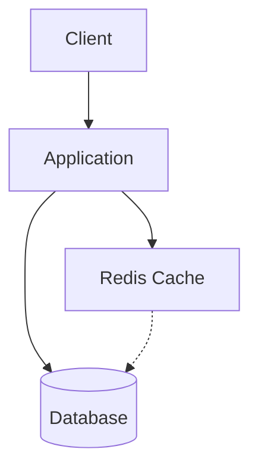

# Day 3: Caching Strategies and Implementation

## Overview
Caching improves performance by storing frequently accessed data in fast storage, reducing database load and response times.

## Key Concepts
- **Cache-aside**
- **Write-through**
- **Write-behind**
- **TTL**
- **Cache Invalidation**

## System Diagram

## Real-World Example
Reddit uses Redis for caching hot posts and comments to handle millions of requests per second

## Discussion Questions
1. How would you implement cache invalidation for a social media feed?
2. What are the trade-offs between write-through and write-behind caching?

## Additional Resources
- [System Design Interview Guide](https://github.com/donnemartin/system-design-primer)
- [High Scalability](http://highscalability.com/)

---
*Generated on 2025-10-10 | [Take Today's Quiz](../docs/quiz-2025-10-10.html)*
