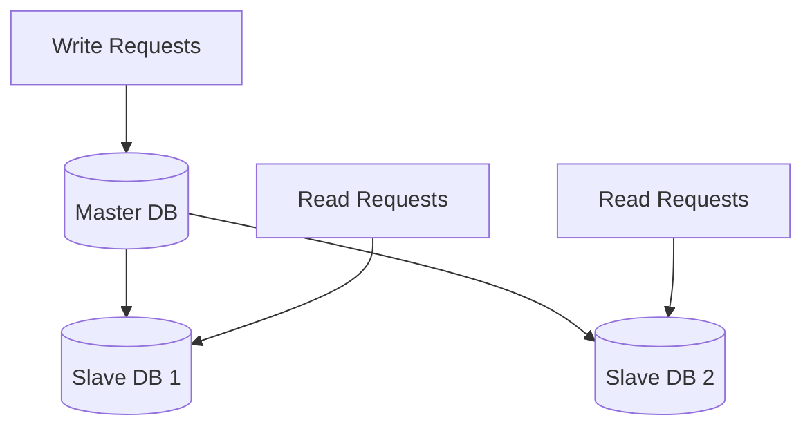

# Day 9: Data Replication for High Availability

## Overview
Database replication creates copies of data across multiple servers to ensure availability and improve read performance.

## Key Concepts
- **Master-Slave**
- **Master-Master**
- **Synchronous vs Asynchronous**
- **Read Replicas**

## System Diagram

## Real-World Example
MySQL's master-slave replication allows Wikipedia to serve millions of read requests from replica databases

## Discussion Questions
1. How would you handle replication lag in a read-heavy application?
2. What are the trade-offs between synchronous and asynchronous replication?

## Additional Resources
- [System Design Interview Guide](https://github.com/donnemartin/system-design-primer)
- [High Scalability](http://highscalability.com/)

---
*Generated on 2025-10-16 | [Take Today's Quiz](../docs/quiz-2025-10-16.html)*
