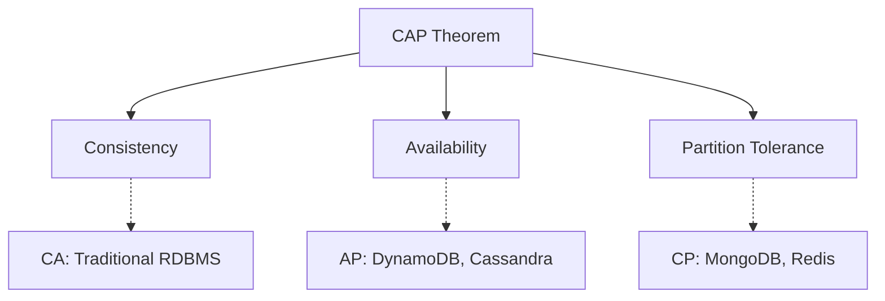

# Day 10: Consistency, Availability, and Partition Tolerance

## Overview
CAP theorem states that distributed systems can guarantee at most two of three properties: Consistency, Availability, and Partition tolerance.

## Key Concepts
- **Consistency**
- **Availability**
- **Partition Tolerance**
- **Eventual Consistency**

## System Diagram

## Real-World Example
Amazon DynamoDB chooses availability and partition tolerance over strong consistency for their shopping cart system

## Discussion Questions
1. In what scenarios would you prioritize consistency over availability?
2. How does eventual consistency work in practice?

## Additional Resources
- [System Design Interview Guide](https://github.com/donnemartin/system-design-primer)
- [High Scalability](http://highscalability.com/)

---
*Generated on 2025-10-17 | [Take Today's Quiz](../docs/quiz-2025-10-17.html)*
