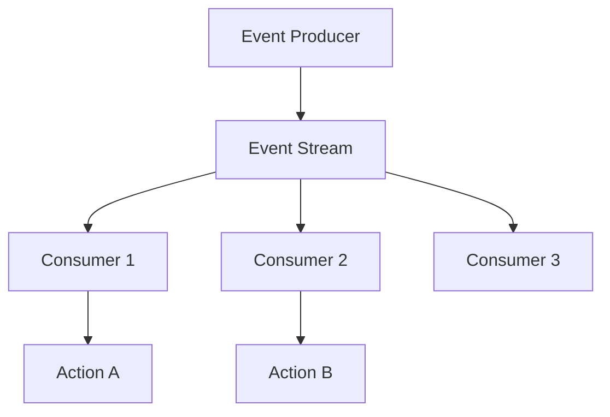

# Day 18: Asynchronous Event Processing

## Overview
Event-driven architecture uses events to trigger and communicate between loosely coupled services, enabling reactive and scalable systems.

## Key Concepts
- **Event Sourcing**
- **CQRS**
- **Event Streaming**
- **Saga Pattern**

## System Diagram

## Real-World Example
LinkedIn's Kafka-based event streaming platform processes over 7 trillion messages per day for real-time analytics and recommendations

## Discussion Questions
1. How do you handle event ordering in a distributed event-driven system?
2. What are the challenges of implementing saga patterns for distributed transactions?

## Additional Resources
- [System Design Interview Guide](https://github.com/donnemartin/system-design-primer)
- [High Scalability](http://highscalability.com/)

---
*Generated on 2025-10-25 | [Take Today's Quiz](../docs/quiz-2025-10-25.html)*
