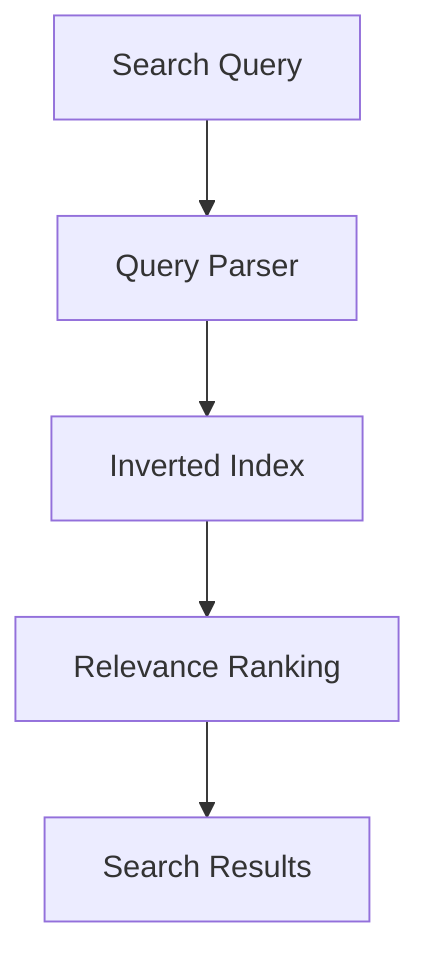

# Day 13: Building Scalable Search Infrastructure

## Overview
Search systems enable fast retrieval of relevant information from large datasets using indexing, ranking, and query processing techniques.

## Key Concepts
- **Inverted Index**
- **TF-IDF**
- **Elasticsearch**
- **Relevance Scoring**

## System Diagram

## Real-World Example
Elasticsearch powers search functionality for GitHub, enabling developers to quickly find code across millions of repositories

## Discussion Questions
1. How would you handle real-time search index updates for a social media platform?
2. What strategies improve search relevance for e-commerce applications?

## Additional Resources
- [System Design Interview Guide](https://github.com/donnemartin/system-design-primer)
- [High Scalability](http://highscalability.com/)

---
*Generated on 2025-11-09 | [Take Today's Quiz](../docs/quiz-2025-11-09.html)*
