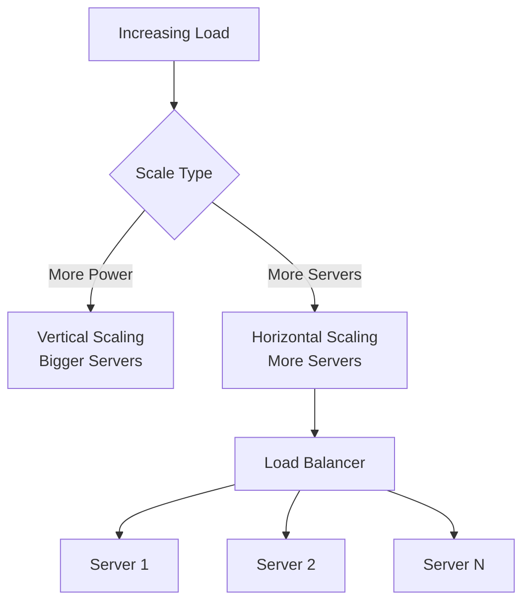

# Day 20: Designing for Growth and Scale

## Overview
Scalability patterns provide proven approaches to handle increasing load through horizontal scaling, vertical scaling, and architectural improvements.

## Key Concepts
- **Horizontal Scaling**
- **Vertical Scaling**
- **Auto-scaling**
- **Performance Optimization**

## System Diagram

## Real-World Example
WhatsApp handles 100 billion messages per day using horizontal scaling with minimal servers through efficient architecture design

## Discussion Questions
1. How do you decide between horizontal and vertical scaling for different components?
2. What metrics should trigger auto-scaling decisions in cloud environments?

## Additional Resources
- [System Design Interview Guide](https://github.com/donnemartin/system-design-primer)
- [High Scalability](http://highscalability.com/)

---
*Generated on 2025-11-16 | [Take Today's Quiz](../docs/quiz-2025-11-16.html)*
