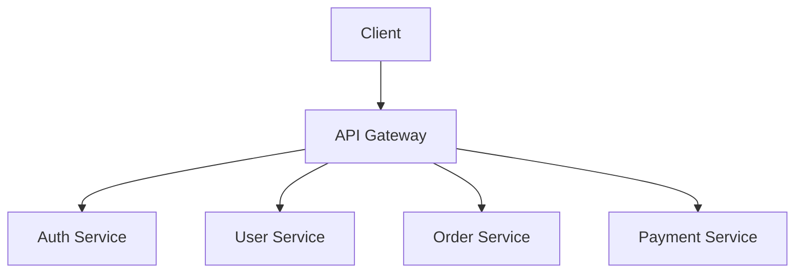

# Day 6: Decomposing Monoliths into Microservices

## Overview
Microservices architecture breaks applications into small, independent services that communicate over well-defined APIs.

## Key Concepts
- **Service Boundaries**
- **API Gateway**
- **Inter-service Communication**
- **Data Consistency**

## System Diagram

## Real-World Example
Amazon has over 100 microservices powering their e-commerce platform, each owned by small teams

## Discussion Questions
1. How do you handle distributed transactions across microservices?
2. What criteria would you use to define service boundaries?

## Additional Resources
- [System Design Interview Guide](https://github.com/donnemartin/system-design-primer)
- [High Scalability](http://highscalability.com/)

---
*Generated on 2025-11-22 | [Take Today's Quiz](../docs/quiz-2025-11-22.html)*
