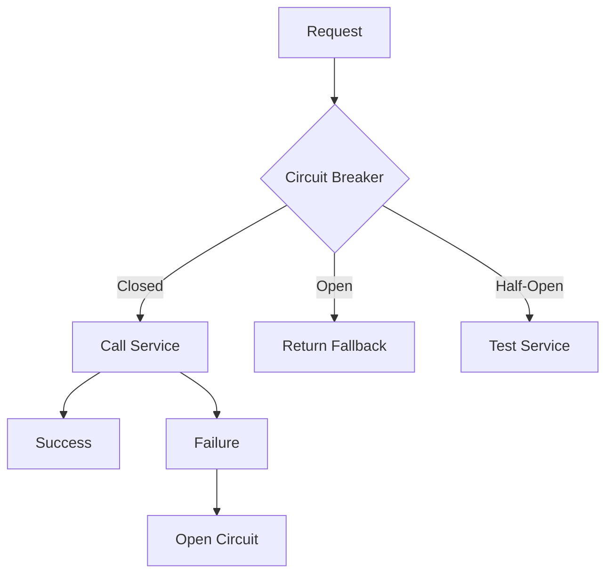

# Day 17: Preventing Cascading Failures

## Overview
Circuit breakers protect systems from cascading failures by temporarily blocking requests to failing services and allowing them to recover.

## Key Concepts
- **Closed State**
- **Open State**
- **Half-Open State**
- **Failure Threshold**

## System Diagram

## Real-World Example
Netflix's Hystrix library implements circuit breakers to prevent cascading failures across their microservices architecture

## Discussion Questions
1. How do you determine appropriate failure thresholds for circuit breakers?
2. What fallback strategies work best for different types of services?

## Additional Resources
- [System Design Interview Guide](https://github.com/donnemartin/system-design-primer)
- [High Scalability](http://highscalability.com/)

---
*Generated on 2025-12-03 | [Take Today's Quiz](../docs/quiz-2025-12-03.html)*
