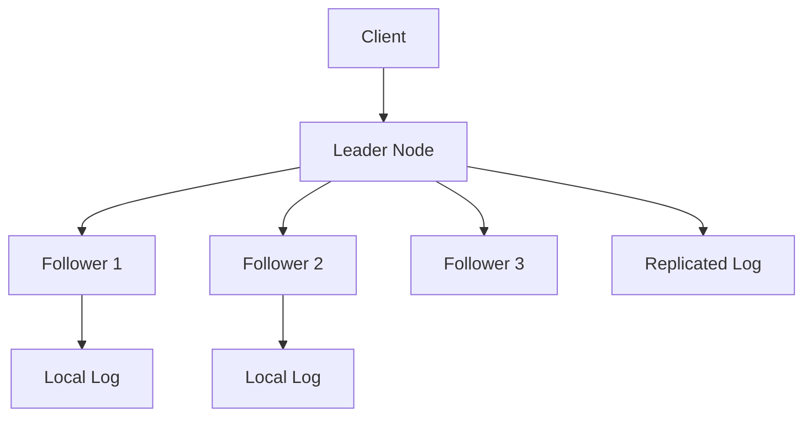

# Day 19: Agreement in Distributed Systems

## Overview
Distributed consensus algorithms enable multiple nodes to agree on a single value or state despite failures and network issues.

## Key Concepts
- **Raft Algorithm**
- **Paxos**
- **Leader Election**
- **Log Replication**

## System Diagram

## Real-World Example
etcd uses Raft consensus to maintain consistent configuration data for Kubernetes clusters across multiple servers

## Discussion Questions
1. How does the Raft algorithm handle network partitions?
2. When would you choose Paxos over Raft for consensus?

## Additional Resources
- [System Design Interview Guide](https://github.com/donnemartin/system-design-primer)
- [High Scalability](http://highscalability.com/)

---
*Generated on 2025-12-05 | [Take Today's Quiz](../docs/quiz-2025-12-05.html)*
