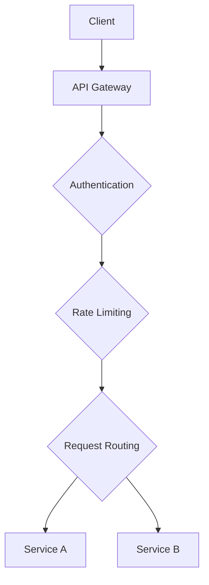

# Day 7: Centralized API Management

## Overview
API gateways provide a single entry point for client requests, handling cross-cutting concerns like authentication, rate limiting, and routing.

## Key Concepts
- **Request Routing**
- **Authentication**
- **Rate Limiting**
- **Request/Response Transformation**

## System Diagram

## Real-World Example
Netflix's Zuul gateway handles billions of requests daily, providing resilience and monitoring for their microservices

## Discussion Questions
1. How would you implement versioning through an API gateway?
2. What are the trade-offs of using an API gateway vs direct service communication?

## Additional Resources
- [System Design Interview Guide](https://github.com/donnemartin/system-design-primer)
- [High Scalability](http://highscalability.com/)

---
*Generated on 2025-12-13 | [Take Today's Quiz](../docs/quiz-2025-12-13.html)*
