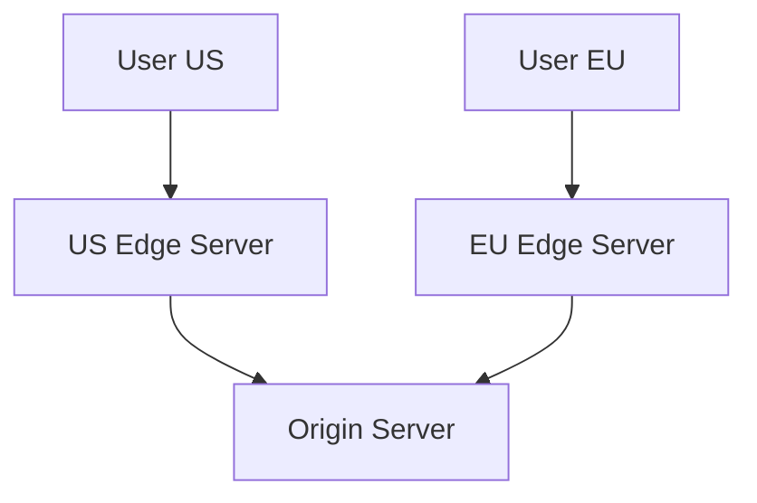

# Day 4: CDN Architecture and Edge Computing

## Overview
CDNs distribute content across geographically dispersed servers to reduce latency and improve user experience globally.

## Key Concepts
- **Edge Servers**
- **Origin Server**
- **Cache Hit Ratio**
- **Geographic Distribution**

## System Diagram

## Real-World Example
Cloudflare operates 250+ data centers globally to serve static content with minimal latency

## Discussion Questions
1. How would you handle dynamic content with a CDN?
2. What strategies would you use to optimize cache hit ratios?

## Additional Resources
- [System Design Interview Guide](https://github.com/donnemartin/system-design-primer)
- [High Scalability](http://highscalability.com/)

---
*Generated on 2026-01-04 | [Take Today's Quiz](../docs/quiz-2026-01-04.html)*
