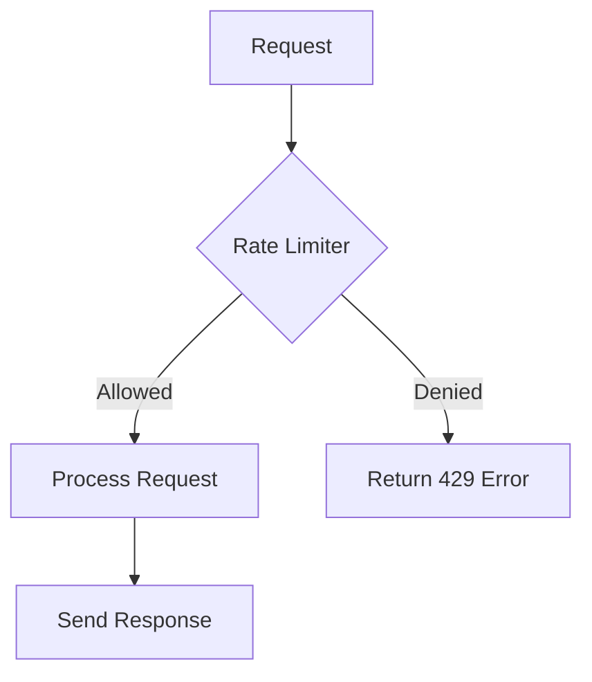

# Day 11: Protecting Systems from Overload

## Overview
Rate limiting controls the number of requests a client can make to prevent system overload and ensure fair resource usage.

## Key Concepts
- **Token Bucket**
- **Leaky Bucket**
- **Fixed Window**
- **Sliding Window**

## System Diagram

## Real-World Example
Twitter's API rate limiting prevents abuse while allowing legitimate developers to build applications on their platform

## Discussion Questions
1. How would you implement distributed rate limiting across multiple servers?
2. What factors determine appropriate rate limits for different API endpoints?

## Additional Resources
- [System Design Interview Guide](https://github.com/donnemartin/system-design-primer)
- [High Scalability](http://highscalability.com/)

---
*Generated on 2026-01-11 | [Take Today's Quiz](../docs/quiz-2026-01-11.html)*
