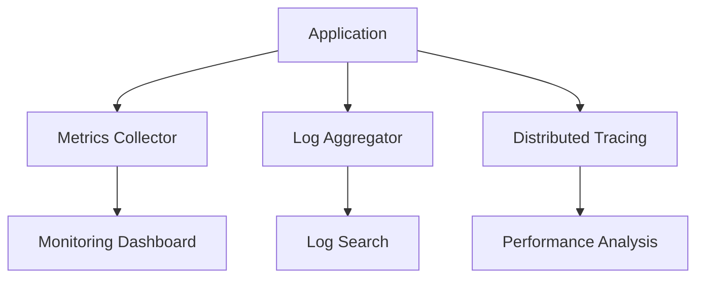

# Day 12: Observability in Distributed Systems

## Overview
Comprehensive monitoring and logging provide visibility into system health, performance, and behavior for troubleshooting and optimization.

## Key Concepts
- **Metrics**
- **Logs**
- **Traces**
- **Alerting**
- **Dashboards**

## System Diagram

## Real-World Example
Google's SRE practices use SLIs, SLOs, and error budgets to maintain 99.99% uptime across their services

## Discussion Questions
1. How do you balance detailed logging with system performance?
2. What metrics are most important for measuring system health?

## Additional Resources
- [System Design Interview Guide](https://github.com/donnemartin/system-design-primer)
- [High Scalability](http://highscalability.com/)

---
*Generated on 2026-01-12 | [Take Today's Quiz](../docs/quiz-2026-01-12.html)*
