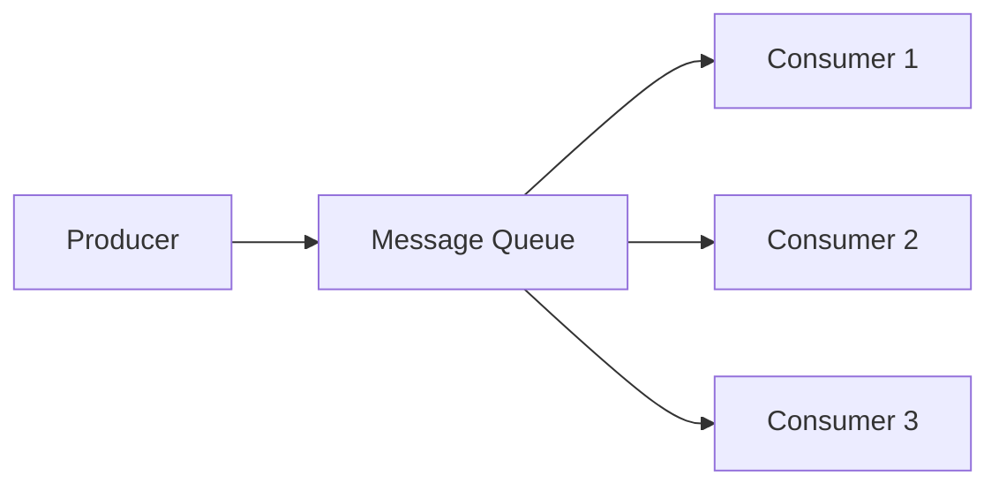

# Day 5: Asynchronous Communication Patterns

## Overview
Message queues enable asynchronous communication between services, improving system resilience and scalability.

## Key Concepts
- **Producer-Consumer**
- **Pub-Sub**
- **Dead Letter Queues**
- **Message Ordering**

## System Diagram

## Real-World Example
Uber uses Apache Kafka to handle real-time location updates and trip matching across their platform

## Discussion Questions
1. How would you ensure message ordering in a distributed queue system?
2. When would you choose RabbitMQ over Apache Kafka?

## Additional Resources
- [System Design Interview Guide](https://github.com/donnemartin/system-design-primer)
- [High Scalability](http://highscalability.com/)

---
*Generated on 2026-01-25 | [Take Today's Quiz](../docs/quiz-2026-01-25.html)*
